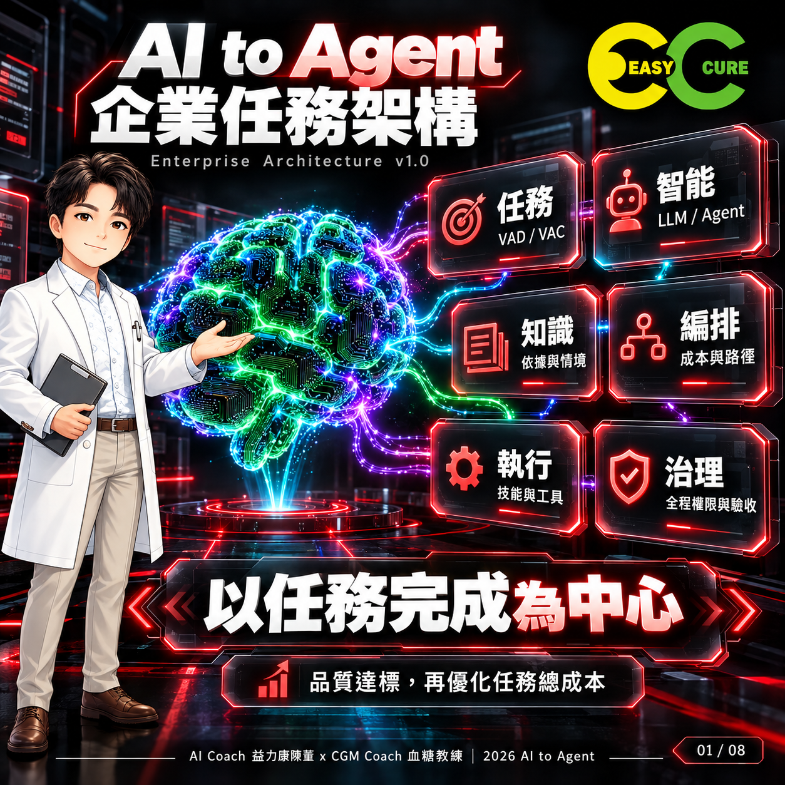
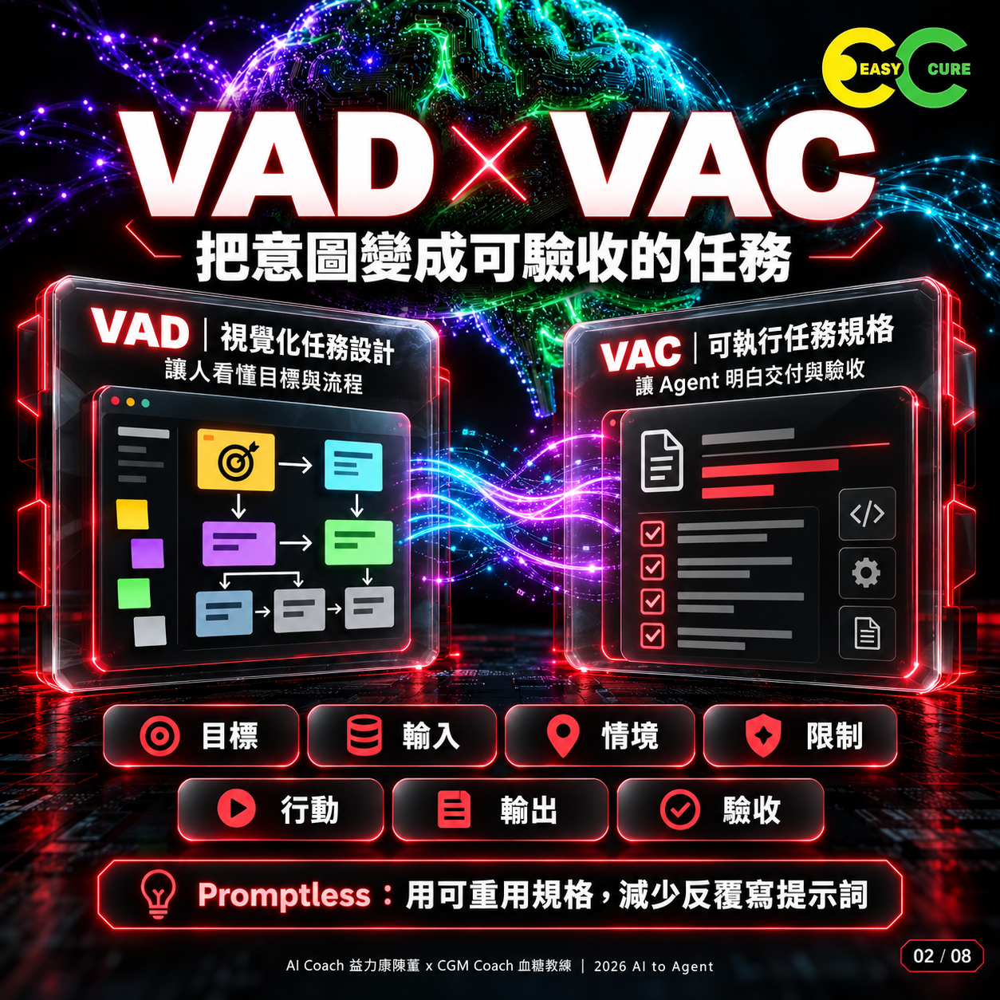
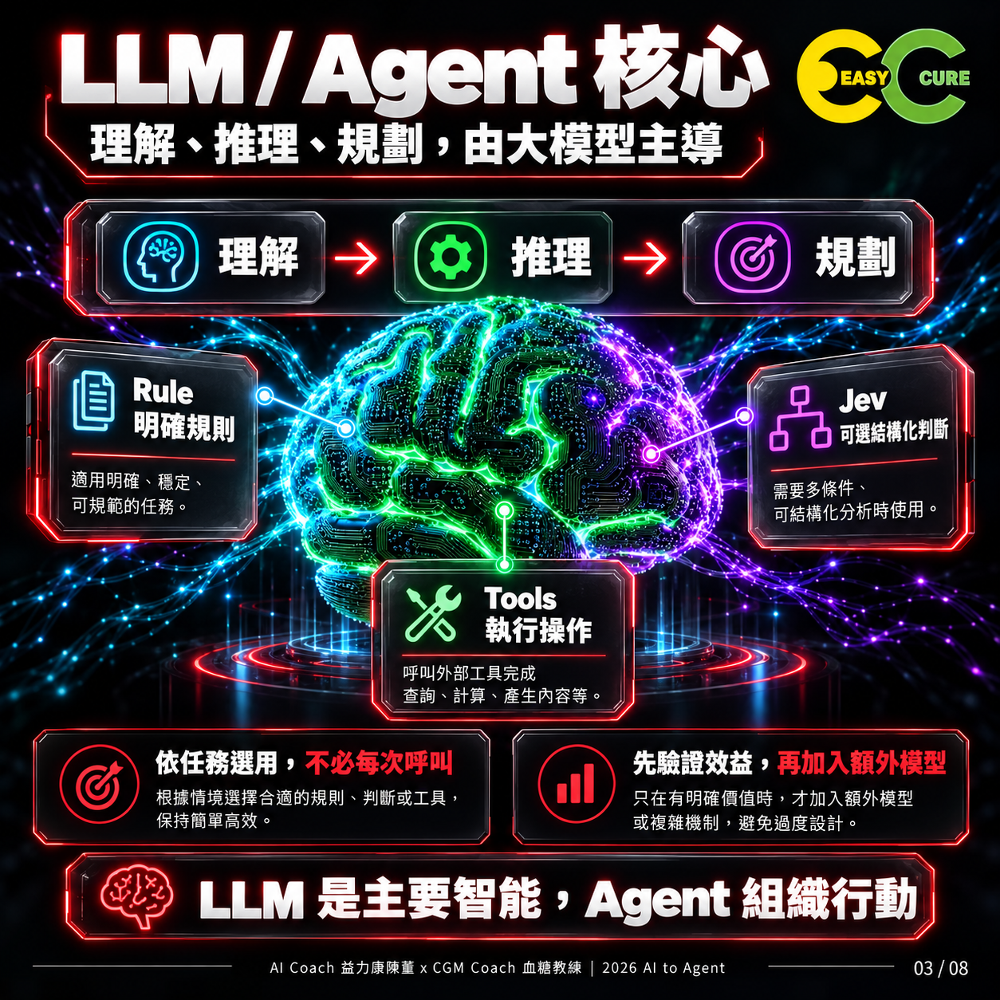
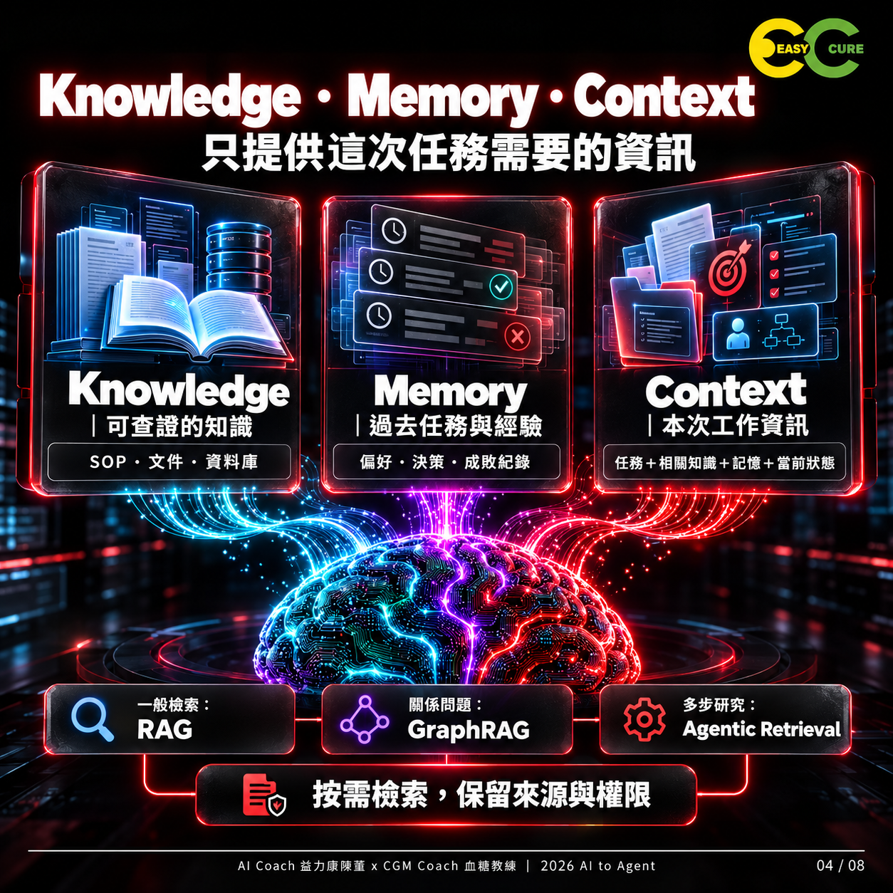
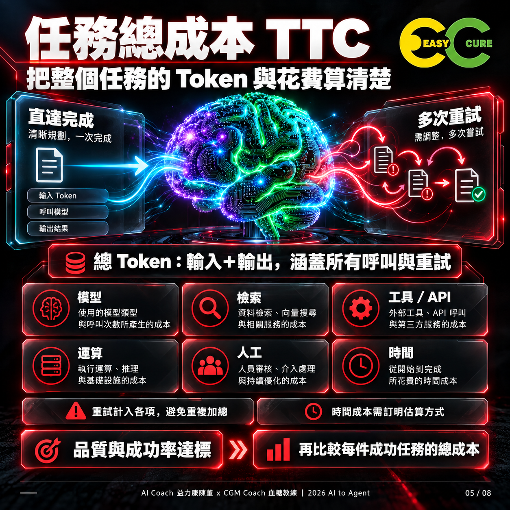
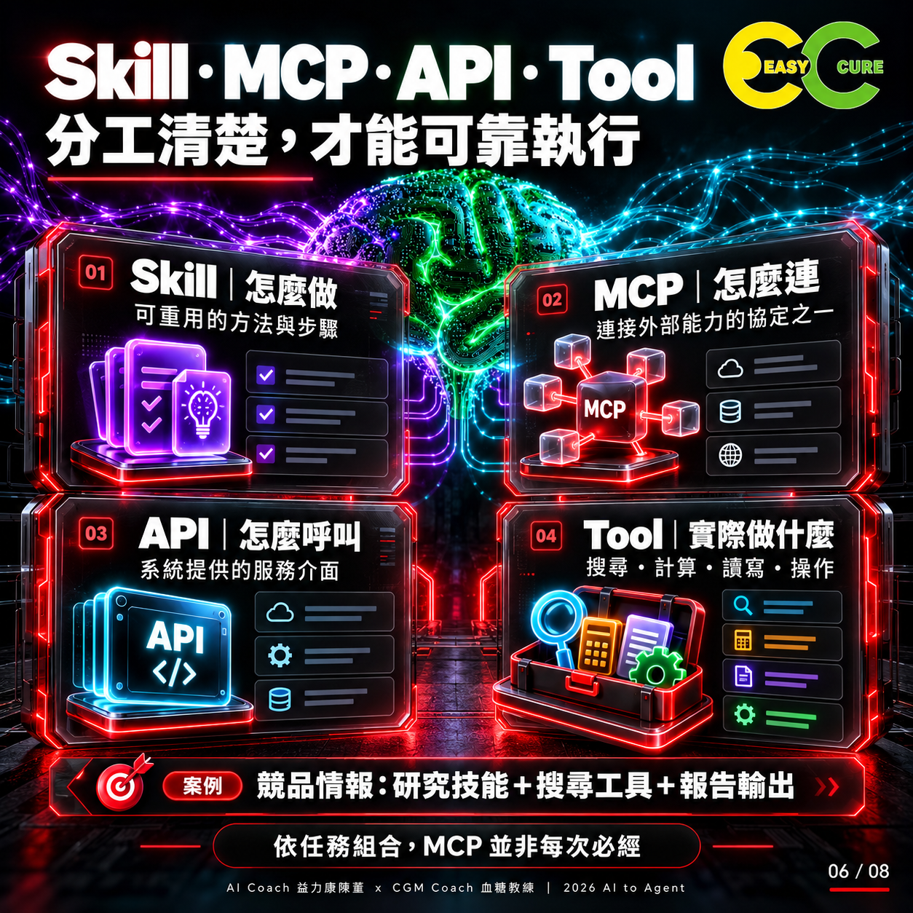
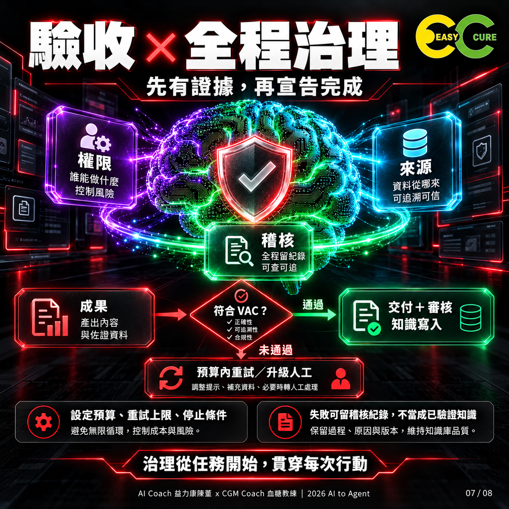
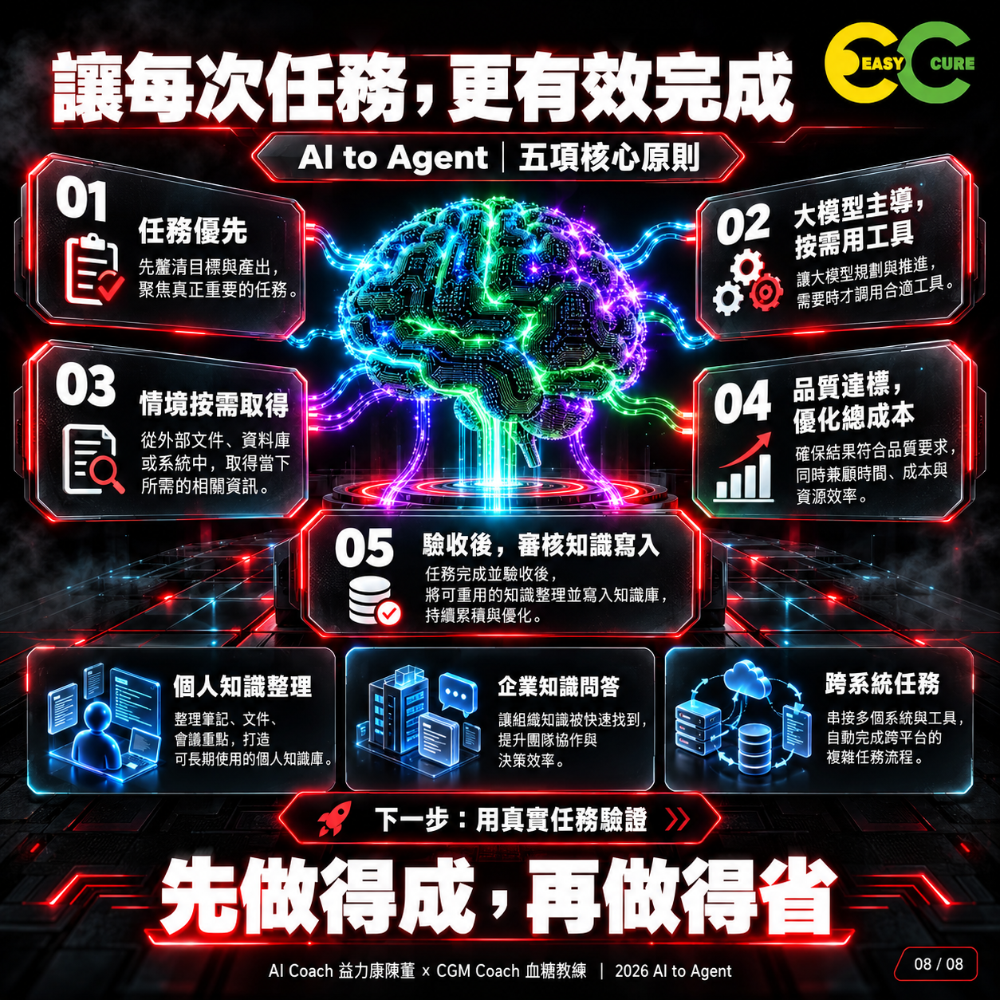

# 圖卡導覽與替代文字

依頁碼閱讀；所有圖卡為本次 AI 生成教育素材。文字定義以方法論文件為準。

## 01｜企業任務架構總覽

以任務完成為中心；任務、智能、知識、編排、執行、治理六項責任相互協作。

## 02｜VAD 與 VAC

VAD 讓人理解任務，VAC 描述目標、輸入、情境、限制、行動、輸出及驗收。

## 03｜LLM 與 Agent 核心

LLM/Agent 理解、推理與規劃；規則、Jev 與工具按需加入，效益須驗證。

## 04｜知識、記憶與情境

Knowledge 是知識，Memory 是歷史，Context 是這次使用的資訊；檢索需保留來源與權限。

## 05｜任務總成本 TTC

統計全部呼叫與重試的 Token；模型、檢索、工具、運算、人工與時間互斥計費。

## 06｜Skill、MCP、API 與 Tool

Skill 是方法，MCP 是連接協定之一，API 是服務介面，Tool 是執行功能。

## 07｜驗收與全程治理

治理貫穿任務；成果對照 VAC，失敗在預算內重試或停止；知識寫入另行審核。

## 08｜五項核心原則

任務優先、大模型主導、情境按需、品質達標後優化成本、驗收後審核知識寫入。
