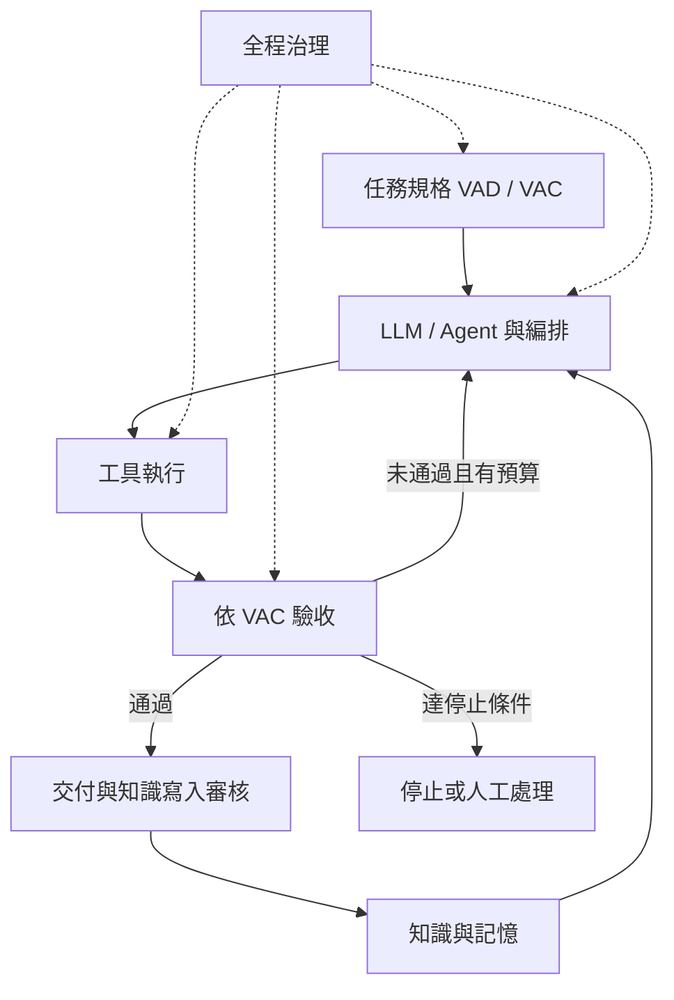

# 方法論定義

文件基線 v1.0.0，2026-09-27。AI Coach 益力康陳董 x CGM Coach 血糖教練 | 2026 AI to Agent

## 核心命題

在任務品質、權限、期限及成功率要求之內，以可量測的證據改善完成路徑及整體成本。選路依可用資訊與歷史數據做估計，不保證每次找到全域最低成本。

## 六大系統

| 系統 | 責任 | 可核對產物 |
|---|---|---|
| Task | VAD 表達意圖，VAC 定義規格 | 任務圖、任務契約 |
| Intelligence | LLM 理解推理；Agent 推進任務 | 計畫、選擇理由、狀態 |
| Knowledge | 提供有來源及權限的知識、記憶、情境 | 引用片段與版本 |
| Orchestration | 選模型、檢索、工具、停止與升級 | 執行路徑與預算紀錄 |
| Execution | 依技能方法呼叫可用工具 | 操作結果及回執 |
| Governance | 全程權限、來源、稽核與驗收 | 決策及驗收證據 |

## 名詞邊界

- VAD：本方法論採 Visual Agent Design，中文「視覺化任務設計」，讓人機快速理解目標、流程與交接。
- VAC：可執行、可驗證、可交接的任務規格；不另創新的英文全名。至少包含目標、輸入、情境、限制、行動、輸出及驗收。
- Promptless：以可重用規格減少手寫提示，不表示底層完全沒有指令。
- Knowledge：可查證且具適用範圍的內容；PDF、Markdown、資料庫是載體。
- Memory：歷史任務與經驗，必須標示成功、失敗、未驗證等狀態。
- Context：本次任務使用的規格、相關知識、記憶、當前狀態與權限，不是整座知識庫。
- RAG、GraphRAG：利用檢索輔助生成的技術路徑，並非知識本體或必經升級階梯。
- Agentic Retrieval：由 Agent 依任務進度決定後續檢索，不等於所有任務都需多輪研究。
- Skill：可重用方法與步驟，不保證單獨具備可執行程式。
- MCP：工具與資源連接協定之一；API 是服務介面；Tool 是被呼叫的功能。
- Jev：可選的結構化判斷模型參考名稱，不是六系統之一；本套件不包含整合或效能測試。

## 執行關係

治理不是最後才加的關卡。執行前確認權限，檢索時遵守資料權限，操作時留回執，交付時核對驗收。

## 知識寫入規則

任務通過不代表所有輸出自動成為通用知識。寫入時還需確認來源、有效期限、適用對象、敏感度、權利與重複內容。失敗可以留在稽核或經驗記憶，但必須帶狀態，不得混入已驗證事實。

## 五項原則

1. 任務優先：先定完成標準。
2. 大模型主導：理解與規劃為核心，其他能力按需加入。
3. 情境按需：保留足夠證據並控制無關內容。
4. 品質達標後優化成本：統計所有嘗試及人工工作。
5. 驗收後審核寫入：建立來源與狀態邊界。

## 成熟度與證據

此版本是使用者與 AI 協作整理的設計方法論，未宣稱為外部標準、研究定論或經實測的產品。案例為模擬；尚未執行原先規劃的三類壓力測試。圖片用於教學，精確欄位及成本口徑以文字文件為準。
